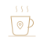

<picture>
  <source media="(prefers-color-scheme: dark)" srcset="./assets/banner-dark.svg">
  
</picture>

 

&nbsp;&nbsp;<picture><source media="(prefers-color-scheme: dark)" srcset="./assets/heading-about-dark.svg"></picture>

Before data, I was support, then development, then data quality — each one left something behind. Support taught me to listen closely to what people actually need. Development turned software engineering into a way of thinking, not just a skill. Quality taught me that good data isn't just collected — it's monitored, validated, and earned.

Today that shows up as pipelines built for large-scale, real-time data, and infrastructure provisioned as code — across AWS, Snowflake, and the tools in between.

 

&nbsp;&nbsp;<picture><source media="(prefers-color-scheme: dark)" srcset="./assets/heading-stack-dark.svg"></picture>

  &nbsp;&nbsp;&nbsp;
  &nbsp;&nbsp;&nbsp;
  &nbsp;&nbsp;&nbsp;
  &nbsp;&nbsp;&nbsp;
  &nbsp;&nbsp;&nbsp;
  &nbsp;&nbsp;&nbsp;
  &nbsp;&nbsp;&nbsp;
  &nbsp;&nbsp;&nbsp;
  &nbsp;&nbsp;&nbsp;
  

 

  <picture>
    <source media="(prefers-color-scheme: dark)" srcset="./assets/stack-dark.svg">
    
  </picture>

 

&nbsp;&nbsp;<picture><source media="(prefers-color-scheme: dark)" srcset="./assets/heading-featured-projects-dark.svg"></picture>

<!--
Card template — copy this block for each project once it's live.
Keep it to: name, stack, one sentence on what it proves.
-->

<!--
**[PROJECT NAME]** — _stack, goes, here_
[One sentence: what problem it solves or what it demonstrates.]
[repo link]
-->

**Conversational Data Agent** — _AWS Bedrock · LangGraph · Snowflake · Terraform_
_TODO: one sentence once the sanitized version is published._
`[link pendente]`

·  ·  ·

**Lakehouse on Databricks** — _Databricks · Delta Lake · PySpark_
_TODO: a deliberate skill-gap project, closed after mapping it against real job requirements._
`[link pendente]`

·  ·  ·

**[College Project, revisited]** — _[stack]_
_TODO._
`[link pendente]`

·  ·  ·

**[Postgraduate Project, revisited]** — _[stack]_
_TODO._
`[link pendente]`

 

<picture><source media="(prefers-color-scheme: dark)" srcset="./assets/heading-connect-dark.svg"></picture>

  <a href="https://www.linkedin.com/in/izadoralis/">
    <picture>
      <source media="(prefers-color-scheme: dark)" srcset="./assets/linkedin-dark.svg">
      
    </picture>
  </a>

 
 

  
  
<i>Want to explore more? Grab your coffee and browse my pinned repos below.</i>

