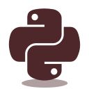
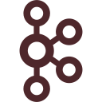
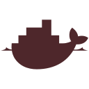
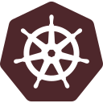

<picture>
  <source media="(prefers-color-scheme: dark)" srcset="./assets/banner-dark.svg">
  
</picture>

 

<picture><source media="(prefers-color-scheme: dark)" srcset="./assets/book-dark.svg"></picture>&nbsp;&nbsp;<picture><source media="(prefers-color-scheme: dark)" srcset="./assets/heading-about-dark.svg"></picture>

Before working with data, I was in support, then I went into development, and later into data quality: each stage taught me something that makes me a better and more complete data engineer today. Support taught me to really listen to what people actually need, to truly hear and understand the pain, and to seek a solution. Development turned software engineering into a way of thinking, a philosophy, not just a skill. Quality taught me that good data isn't just collected, it needs to be monitored, measured, validated, and documented constantly.

Today that shows up as pipelines built at scale, strategic and cross-team, never built just to check a box. Every project has to earn its impact, whether that means pushing something new forward or finally closing an old gap, sometimes both.

 

<picture><source media="(prefers-color-scheme: dark)" srcset="./assets/laptop-dark.svg"></picture>&nbsp;&nbsp;<picture><source media="(prefers-color-scheme: dark)" srcset="./assets/heading-stack-dark.svg"></picture>

<table align="center" border="0" cellspacing="14" cellpadding="0">
<tr>
<td align="center"><picture><source media="(prefers-color-scheme: dark)" srcset="./assets/stack-python-dark.svg"></picture> Python</td>
<td align="center"><picture><source media="(prefers-color-scheme: dark)" srcset="./assets/stack-postgresql-dark.svg"></picture> SQL</td>
<td align="center"><picture><source media="(prefers-color-scheme: dark)" srcset="./assets/stack-amazonwebservices-dark.svg"></picture> AWS</td>
<td align="center"><picture><source media="(prefers-color-scheme: dark)" srcset="./assets/stack-snowflake-dark.svg"></picture> Snowflake</td>
</tr>
<tr>
<td align="center"><picture><source media="(prefers-color-scheme: dark)" srcset="./assets/stack-apacheairflow-dark.svg"></picture> Airflow</td>
<td align="center"><picture><source media="(prefers-color-scheme: dark)" srcset="./assets/stack-apachekafka-dark.svg"></picture> Kafka</td>
<td align="center"><picture><source media="(prefers-color-scheme: dark)" srcset="./assets/stack-dbt-dark.svg"></picture> dbt</td>
<td align="center"><picture><source media="(prefers-color-scheme: dark)" srcset="./assets/stack-terraform-dark.svg"></picture> Terraform</td>
</tr>
<tr>
<td align="center"><picture><source media="(prefers-color-scheme: dark)" srcset="./assets/stack-docker-dark.svg"></picture> Docker</td>
<td align="center"><picture><source media="(prefers-color-scheme: dark)" srcset="./assets/stack-kubernetes-dark.svg"></picture> Kubernetes</td>
<td align="center"><picture><source media="(prefers-color-scheme: dark)" srcset="./assets/stack-apachespark-dark.svg"></picture> PySpark</td>
<td align="center"><picture><source media="(prefers-color-scheme: dark)" srcset="./assets/stack-databricks-dark.svg"></picture> Databricks</td>
</tr>
</table>

 

 

<picture><source media="(prefers-color-scheme: dark)" srcset="./assets/connect-icon-dark.svg"></picture>&nbsp;&nbsp;<picture><source media="(prefers-color-scheme: dark)" srcset="./assets/heading-connect-dark.svg"></picture>

  <a href="https://www.linkedin.com/in/izadoralis/">
    <picture>
      <source media="(prefers-color-scheme: dark)" srcset="./assets/linkedin-dark.svg">
      
    </picture>
  </a>

 
 

  <picture><source media="(prefers-color-scheme: dark)" srcset="./assets/coffee-dark.svg"></picture>
  
<i>Want to explore more? Grab your coffee and browse my pinned repos below.</i>

